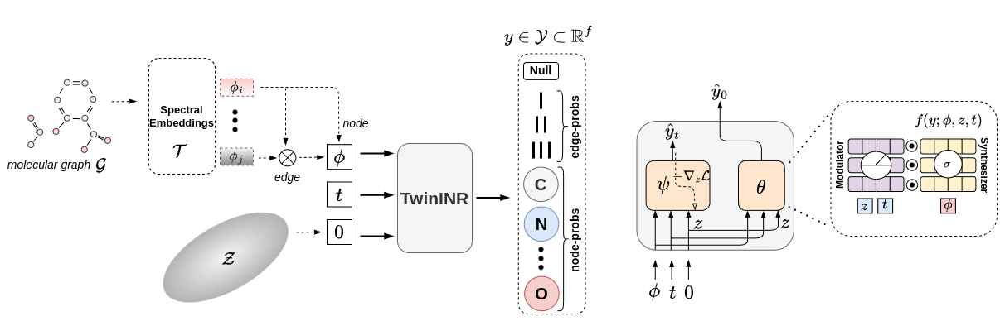

MING: A Functional Approach to Learning Molecular Generative Models
---
### Abstract

Traditional molecule generation methods often rely on sequence or graph-based representations, which can limit their expressive power or require complex permutation-equivariant architectures. This paper introduces a novel paradigm for learning molecule generative models based on functional representations. Specifically, we propose Molecular Implicit Neural Generation (MING), a diffusion-based model that learns molecular distributions in the function space. Unlike standard diffusion processes in the data space, MING employs a novel functional denoising probabilistic process, which jointly denoises the information in both the function's input and output spaces by leveraging an expectation-maximization procedure for latent implicit neural representations of data. This approach allows for a simple yet effective model design that accurately captures underlying function distributions. Experimental results on molecule-related datasets demonstrate MING's superior performance and ability to generate plausible molecular samples, surpassing state-of-the-art data-space methods while offering a more streamlined architecture and significantly faster generation times.

<p align="center">
    
</p>

## Dependency

MING is built upon **Python 3.10.1** and **Pytorch 1.12.1**. To install additional packages, run the below command:

```sh
pip install -r requirements.txt
```

And `rdkit` for molecule graphs:

```sh
conda install -c conda-forge rdkit=2020.09.1.0
```

## Data

We follow [GDSS](https://github.com/harryjo97/GDSS/tree/master) to set up QM9, ZINC250k and [DiGress](https://github.com/cvignac/DiGress/tree/main) to set up MOSES. To download data, run:

```sh
sh setup.sh
```

## Training

We provide MING's hyperparameters in the `config/exp` folder.


```sh
cd ming
sh sh_run.sh -d ${dataset} -t diff -e exp -n ${name}
```

where:
- `dataset`: data type (in `config/data`)
- `name`: name of experiment (in `exp/name`)

Example:

```sh
cd ming
sh sh_run.sh -d zinc -t diff -e exp -n zinc
```

## Sampling

Set up  different sampling batch size (`SAMPLER_BATCH`) to adapt sepecific hardware contraints in `ming/sh_run.sh`

```
export SAMPLER_BATCH=2024
```

We provide code that caculates the mean and std of different metrics on sampled molecules (3x samplings).

```sh
cd ming
sh sh_run.sh -d ${dataset} -t sample -e exp -n ${name}
```

where:
- `dataset`: data type (in `config/data`)
- `name`: name of experiment (in `exp/name`)

Example:

```sh
cd ming
sh sh_run.sh -d zinc -t sample -e exp -n zinc
```

To download our model checkpoints, run:

```sh
sh setup.sh -t ckpt
```

## Citation

Please refer to our work if you find our paper with the released code useful in your research. Thank you!

```
@article{nguyen2024ming,
  title={MING: A Functional Approach to Learning Molecular Generative Models},
  author={Nguyen, Van Khoa and Falkiewicz, Maciej and Mercatali, Giangiacomo and Kalousis, Alexandros},
  journal={arXiv preprint arXiv:2410.12522},
  year={2024}
}
```